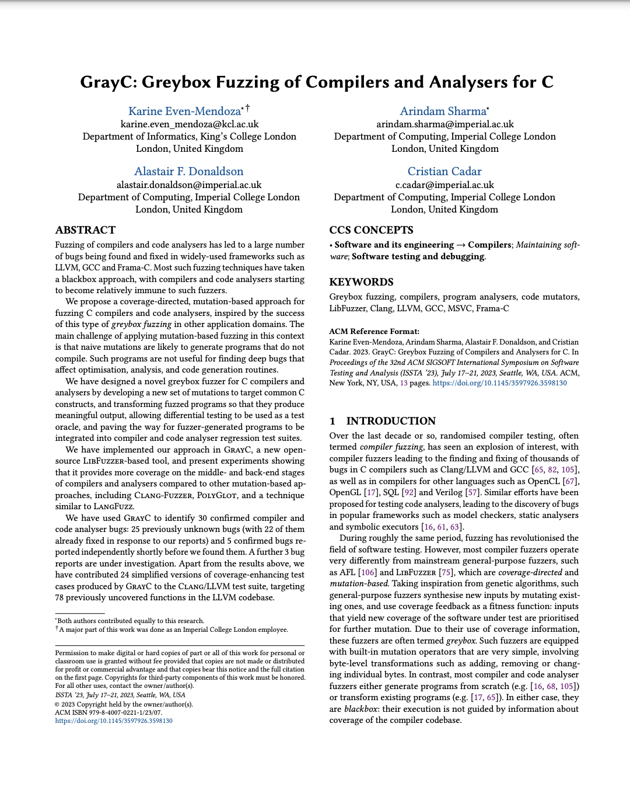

# GrayC: A fuzzer for C compilers and code analyzers
<a href="https://srg.doc.ic.ac.uk/files/papers/grayc-issta-23.pdf" target="_blank"></a>
The GrayC approach involves using mutation-based fuzzing as a program generation technique, and then using the generated programs to test compilers and analysers.  

See the following links for the ISSTA 2023 [artifact](https://zenodo.org/record/7973856), 
[code](ISSTA-2023-AE) and [general instructions](ISSTA-2023-AE/README.md) 
of the "GrayC: Greybox Fuzzing of Compilers and Analysers for C" publication.


## Installation

```
wget -O - https://apt.llvm.org/llvm-snapshot.gpg.key | sudo apt-key add -
sudo apt-add-repository "deb http://apt.llvm.org/bionic/ llvm-toolchain-bionic-12 main"
sudo apt-get update
sudo apt-get install -y llvm-12 llvm-12-dev llvm-12-tools clang-12 libclang-common-12-dev libclang-12-dev 

This builds both LLVM and Clang on Ubuntu

git clone https://github.com/srg-imperial/GrayC.git
cd GrayC
mkdir build
cd build
cmake -GNinja -DCMAKE_C_COMPILER=gcc-11 -DCMAKE_CXX_COMPILER=g++-11 -DLLVM_CONFIG_BINARY=llvm-config-12 ../
ninja
```

